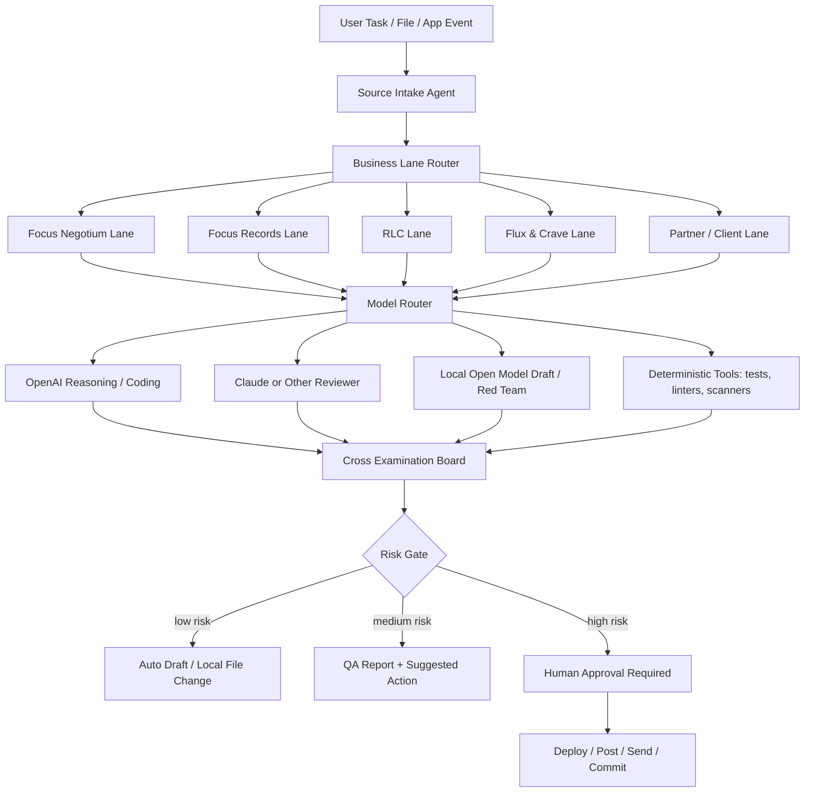

# Focus Private AI Engine Blueprint ? Reality Check + Build Path

## Short answer

Your imagined system is **directionally real**, but not exactly in the form ?guardrail-free ChatGPT/OpenAI twin + guardrail-free Claude twin.? OpenAI and Claude models cannot be turned into guardrail-free clones or stripped of provider safety systems.

The buildable version is stronger and safer:

- A Focus-owned orchestration layer.
- Multiple model lanes: OpenAI/Claude for high-quality reasoning where allowed, local/open-source models for private/offline drafting and red-team critique, code tools for deterministic checks.
- Business-specific knowledge bases for Focus Negotium Inc, Focus Records LLC, Royal Lee Construction Solutions LLC, Flux & Crave, and partner/client lanes.
- Self-improving prompts/configs through versioned proposals, tests, and human approval ? not uncontrolled self-rewriting.
- A QA/evaluator layer that cross-examines every task before deployment, outreach, legal/financial/property claims, or code push.

## What matches your vision

1. **Cross-examining agents** ? yes. A prompt can pass through researcher, builder, critic, compliance checker, code reviewer, and deployment gate.
2. **Business-tailored front end** ? yes. The UI can expose lanes for Focus Negotium, Focus Records, RLC, Flux & Crave, and other businesses.
3. **Code repair loop** ? yes. The system can run tests, inspect errors, rewrite patches, and re-test.
4. **Private/local lane** ? yes. Local models can support private drafting, logs, and offline work.
5. **Prompt rewriting** ? yes, if changes are versioned and tested.

## What does not match reality

1. **No-censorship OpenAI/Claude twins** ? not possible through official APIs.
2. **Unbounded self-rewriting production system** ? dangerous; should be staged through approvals and tests.
3. **Automatic legal/financial/property/contract claims** ? should stay approval-gated because mistakes can create real-world harm.
4. **Secret use without audit** ? secrets should be retrieved only at runtime, never printed, committed, or copied casually.

## Recommended engine architecture

## Guardrail design that still feels powerful

Replace ?guardrail-free? with **operator-controlled**:

- No censorship for ordinary ideation, design, marketing drafts, code exploration, internal critique, and creative strategy.
- Guardrails only where consequences are real: credentials, legal/financial claims, outreach, public posts, deployments, payments, user data, property/construction claims.
- Every block should explain why and offer a safe executable path.

## Build phases

### Phase 1 ? Orchestrator

- Define lanes, agents, model roles, prompt contracts.
- Store every task as a run record.
- Attach source files, Git commits, and approval status.

### Phase 2 ? Knowledge base

- Ingest local repo docs, Notion exports, Drive docs, approved brand facts, service pages, and active offers.
- Tag facts by business lane and approval status.

### Phase 3 ? Code/action runner

- Let the system make local patches.
- Require tests before commit.
- Require approval before deploy/post/send.

### Phase 4 ? Private model lane

- Add local open-source model endpoints through Ollama/LM Studio/vLLM.
- Use them for private drafting, adversarial critique, and alternate rewrites.

### Phase 5 ? Dashboard

- Front-end command center with tasks, lanes, QA state, run logs, approvals, social queue, deployment queue, and traffic/audit panel.

## Bottom line

The exact ?uncensored OpenAI/Claude twin? version is not technically or contractually real. The **Focus Private AI Engine** version is real: a multi-model, business-aware, private-first command center that can draft aggressively, cross-check itself, repair code, run tests, and keep high-impact actions under your approval.
